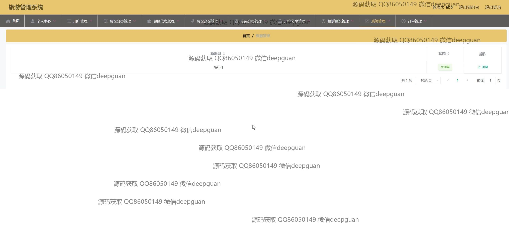

<h1 align="center">旅游管理系统</h1>

## 简介
旅游管理系统：角色分为管理员、用户；用户管理、景区信息管理、订单管理、个人中心、投诉建议功能。管理员负责用户和景区信息的维护，用户可分享旅游体验并管理个人订单和地址。系统界面简洁，功能齐全。    --计算机毕业设计源码；毕设源码；java毕业设计源码

## 联系方式

<h3 align="center">获取完整代码与数据库文件 + 微信：deepguan QQ: 86050149 QQ群: 783742310</h3>

<h3 align="center">可帮忙远程部署 包运行成功！提供远程部署、修改代码、设计文档指导、代码讲解等服务！</h3>

## 功能介绍（完整见运行截图）
管理员：  
基本功能包括登录、注册和退出。主要界面显示的功能有用户管理、景区分类管理、景区信息管理和订单管理。可以添加和更新用户信息，调整景区相关数据。提供处理客户投诉、审查用户反馈和管理分享内容的功能。商品管理模块允许编辑旅游商品的名称、分类、价格和描述。通过查看和回复客户留言提升旅游管理效率。  

用户：  
主要功能模块包含个人中心、我的订单、我的地址和我的收藏。用户可以修改和管理个人信息，如用户名、密码、联系方式和头像。其中订单管理部分能够展示商品详情、价格及支付选项。在用户中心可以增强用户体验的功能有查看旅游景区推荐、商店购物、以及进行反馈或评价等操作。

## 运行截图

本代码来源于网络,仅供学习参考使用!

